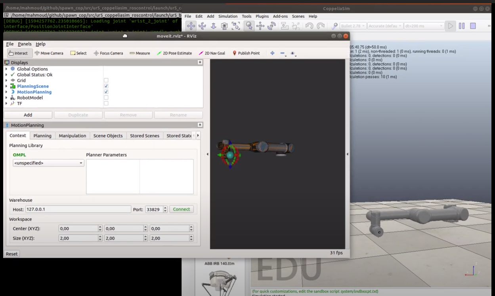

# ur5_coppeliasim_roscontrol
 A demo shows a full integration of roscontrol controllers and coppeliasim simulator. This package contains the required configuration, scene, and launch files to bringup and control ur5 robot in coppeliasim. This demo is a direct application of both the [RosControl][] and the [RosServices][] plugins.
 
## Dependencies
- [coppeliasim_ros_control][]: a plugin to integrate ros_control controller into CoppeliaSim simulator
- [coppeliasim_ros_services][]: a plugin contains a collection of ros-services servers to enable a remote-control of the coppeliasim simulator
- [coppeliasim_msgs_srvs][]: contains the definitations of the required msgs and srvs that enable ros to communicate with/control the coppeliasim simulator
- [coppeliasim_run][]: to run coppeliasim as a ROS node using a system() call
- [ur_description][]: contains the description of the ur5 robot   
- [ur_gazebo][]: contains the `arm_controller` which will be used to control the ur5 robot
- [ur5_moveit_config][]: conatians all launch files required for moveit to control the ur5 robot


### Building 
The following instructions assume that a catkin workspace has been created at `$HOME/catkin_ws` and Coppeliasim directory is placed at the Home directory `$HOME/CoppeliaSim`. you always can update the paths based on your machine setup.

```bash
# change to the src directory in your Catkin workspace
 cd $HOME/catkin_ws/src

# Clone Coppeliasim_ros_control pkg 
 git clone https://github.com/mahmoud-a-ali/ur5_coppeliasim_roscontrol

# change to the main Catkin workspace
 cd ..

# build the workspace (using catkin_tools)
 catkin build

# source the workspace
source devel/setup.bash 
```

### Running
launch the demo using the `ur5_demo.launch` launch file
```
 roslaunch ur5_coppeliasim_roscontrol ur5_demo.launch 
```
the `ur5_demo.launch` launch file will:
- start coppeliasim simulator with a scene includes a ur5 robot
- start the simulation
- load ur5 description to param-server by launching the `ur5_upload.launch` file from the `ur_description` pkg
- load the `arm_controller_ur5.yaml` file from the `ur_gazebo` pkg, the arm_controller is a `position_controllers/JointTrajectoryController` ros-controller
- launch the `controller_utils.launch` file from the `ur_gazebo` pkg 
- spawn the `arm_controller` using the `controller_manager` pkg 
- launch the `ur5_moveit_planning_execution.launch` file from the `ur5_moveit_config` pkg
- launch the `moveit_rviz.launch`file from the `ur5_moveit_config` pkg

By launching the `ur5_demo.launch` launch file, you will see two windows: coppeliasim (with a running simulation for ur5 robot) and rviz (with a motionplanning interface configured for ur5 robot), then you can use the motion planning interface in rviz to control the ur5 robot in coppeliasim. you can use also the available msgs/srvs to control the simulation inside coopeliasim.


### Generate your own configuration package
This package contains configuration/launch/scene files to control ur5 robot in coppeliasiom. If you want to create your own configuration package to control your own robot in coppeliasim, follow these steps:
- Create a scene file in coppeliasim for your own robot e.g.`scene.ttt`. if the model of the robot you are using is available in coppeliasim, then you just need to create new scene and drag the model of your robot in the scene. if it is not available, you can use the [urdf_plugin][] to convert your urdf model to a coppeliasim scene.
- Create a `controller.yaml` file to specify which controller you want to use to control your own robot.
- Create a launch file to:
    - start coppeliasim, pass your robot_scene `scene.ttt` as an argument to the coppeliasim node
    - load your robot_description from your `.xacro` or `.urdf` file to the param server
    - load your `controller.yaml` to param server
    - spawn your controller using the `controller_manager` pkg 

### video
[](https://www.youtube.com/watch?v=2KqA-2pOi4A)


[RosControl]: https://github.com/mahmoud-a-ali/coppeliasim_ros_control
[RosServices]: https://github.com/mahmoud-a-ali/coppeliasim_ros_services
[urdf_plugin]: https://www.coppeliarobotics.com/helpFiles/en/urdfPlugin.htm
[coppeliasim_ros_control]: https://github.com/mahmoud-a-ali/coppeliasim_ros_control
[coppeliasim_ros_services]: https://github.com/mahmoud-a-ali/coppeliasim_ros_services
[coppeliasim_msgs_srvs]: https://github.com/mahmoud-a-ali/coppeliasim_msgs_srvs
[coppeliasim_run]: https://github.com/tud-cor/coppeliasim_run
[ur_description]: https://github.com/ros-industrial/universal_robot
[ur5_moveit_config]:https://github.com/ros-industrial/universal_robot
[ur_gazebo]: https://github.com/ros-industrial/universal_robot
